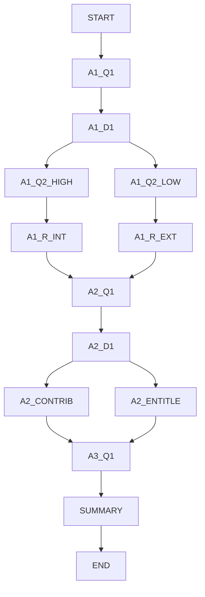

```mermaid id="d9u9w1"
graph TD

START --> A1_Q1
A1_Q1 --> A1_D1
A1_D1 --> A1_Q2_HIGH
A1_D1 --> A1_Q2_LOW

A1_Q2_HIGH --> A1_R_INT
A1_Q2_LOW --> A1_R_EXT

A1_R_INT --> A2_Q1
A1_R_EXT --> A2_Q1

A2_Q1 --> A2_D1
A2_D1 --> A2_CONTRIB
A2_D1 --> A2_ENTITLE

A2_CONTRIB --> A3_Q1
A2_ENTITLE --> A3_Q1

A3_Q1 --> SUMMARY
SUMMARY --> END
```
